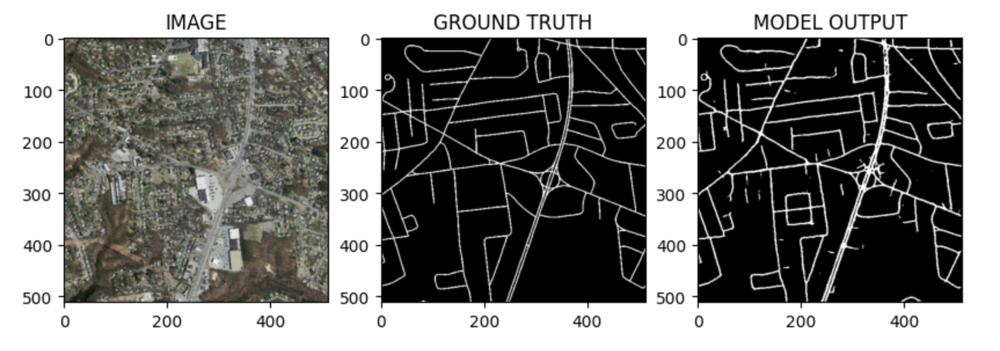

# aerial_image_segmentation

## Maintainer:
data.is4life@gmail.com

## Environment

This project is containerized using Docker so that all system requirements are provided to run the analysis without importing additional packages. The model is built using the Python programming language and the PyTorch library to create a U-Net architecture to segment and process the images. The final trained model is deployed in a browser based application using Streamlit, so the user can input images and produce a corresponding segmented mask showing the road paths in the image.  

## Data

The full dataset from the Massachusetts Roads Dataset contains 1171 aerial images of the state of Massachusetts. Each image is 1500x1500 pixels in size. This project uses a subset of this dataset comprising of 200 aerial images and their corresponding masks. The full dataset can be viewed at https://www.cs.toronto.edu/~vmnih/data/ and the subset dataset was cloned from https://github.com/parth1620/Road_seg_dataset. 

### Instructions:

With Docker running, use this code to build the docker image.  

docker build -t image_segmentation:v1 .  

Once the image is constructed, run this code to run the image and view the app.  

docker run -d -p 8505:8505 image_segmentation:v1

### Summary:

Aerial image segmentation is the process of dividing a high-altitude image of the Earth's surface into meaningful and distinct regions or objects. The goal is to identify and delineate different features in the image, such as buildings, roads, vegetation, water bodies, and other land-use categories. Aerial image segmentation involves a computer analyzing that image and drawing boundaries around specific things like houses, streets, trees, and rivers, essentially helping to break down the image into different recognizable parts. This kind of analysis is valuable in applications such as urban planning, environmental monitoring, and land-use management. 

This project uses aerial imagery from 2.25 square kilometers of aerial imagery from the Massachusetts Road Dataset containing 200 images and their corresponding masks. Using PyTorch and Python, a model is created to identify the roadways in the aerial images. A U-Net architecture is used to downsample the image to reduce its size while extracting important features, condensing the most important features, then upsampling the image to restore its size with an understanding of where the most important features are located and concating them by size along the way. With this encoding and decoding process, the image is processed and the final display shows the original aerial image along side the segmented mask that the machine learning algorithm produced. 

### Final Output Example

